# www_lab_week1
Thực hành www, tuần 01
 
1.Đăng nhập:
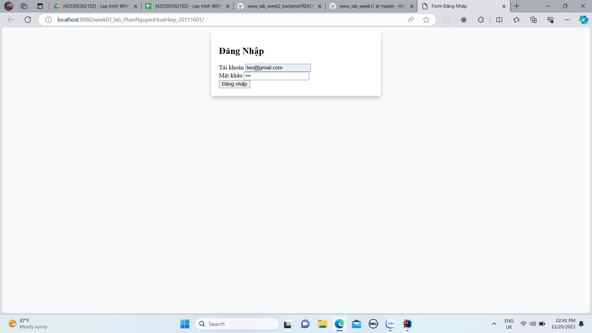
2.Đăng nhập thành công với quyền admin:
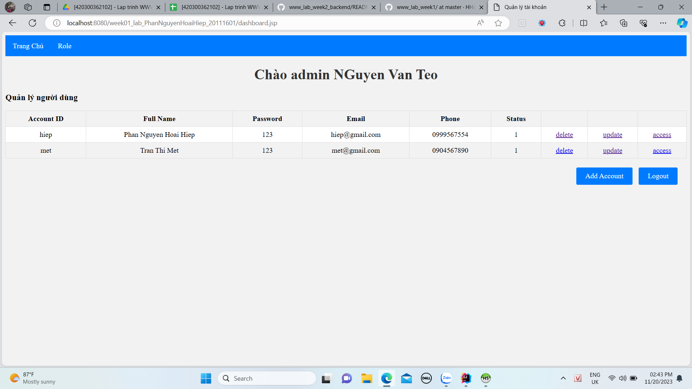
3.Thêm tài khoản:
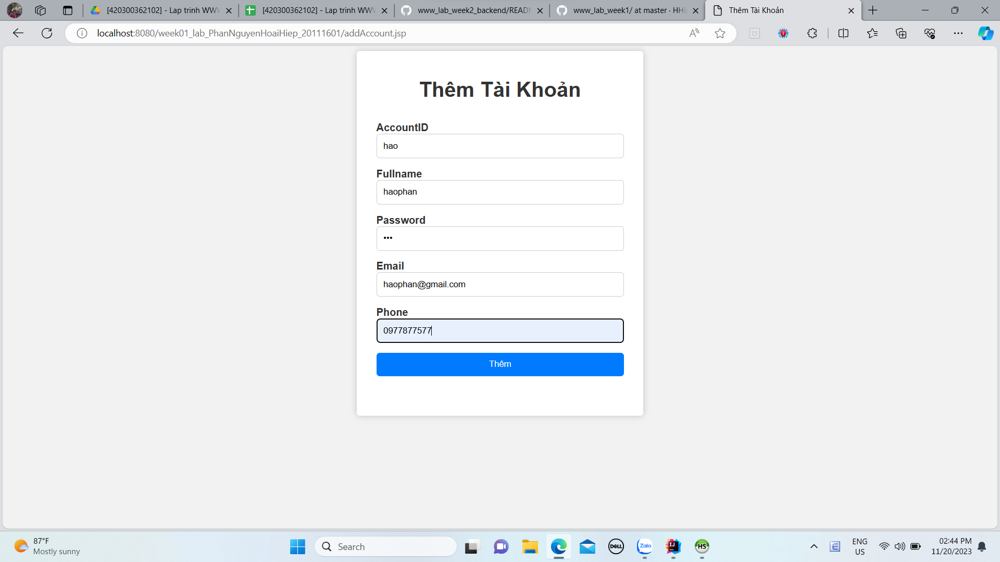
4.Sau khi thêm:
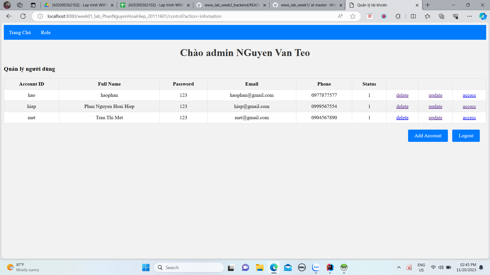
5.Sửa thông fullname của account:
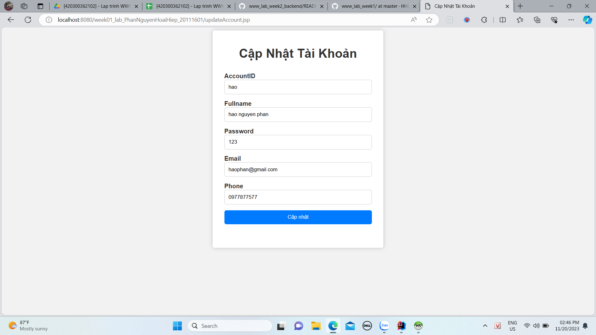
6.Sau khi sửa:

7.Xóa account vừa thêm:
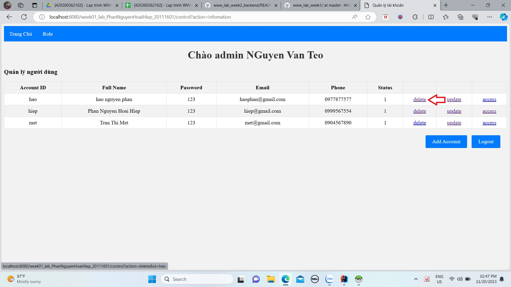
8.Sau khi xóa:
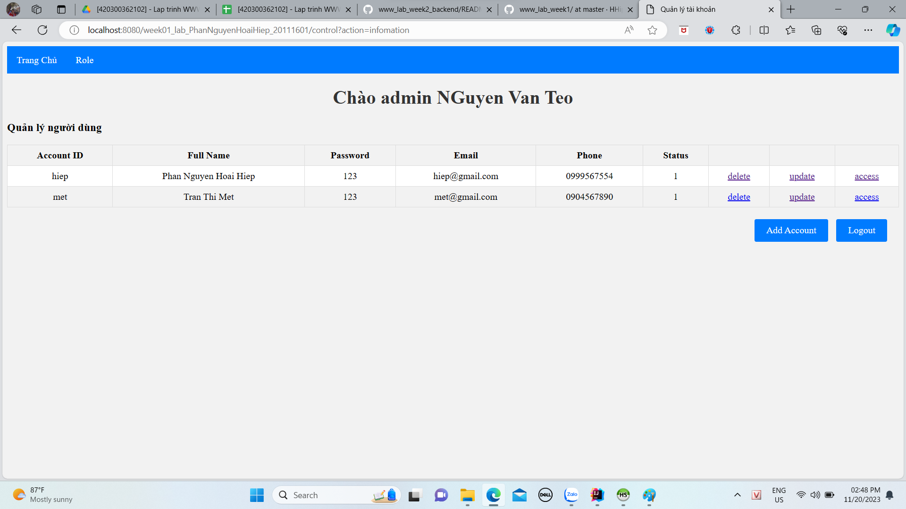
9.Xem role của account đang đăng nhập:
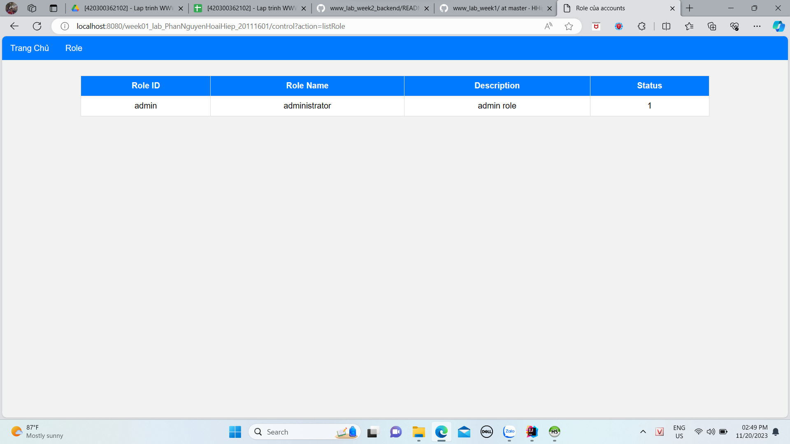
10.Logout:
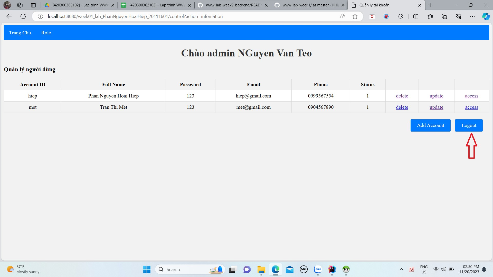
11.Sau khi logout quay về đăng nhập đồng thời có ghi log:
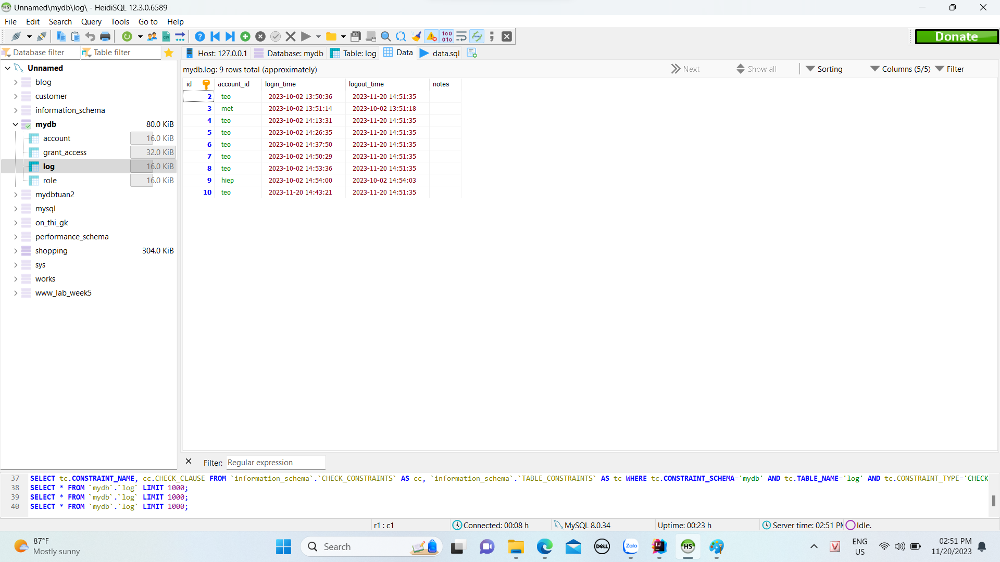
12.Đăng nhập với quyền thường:
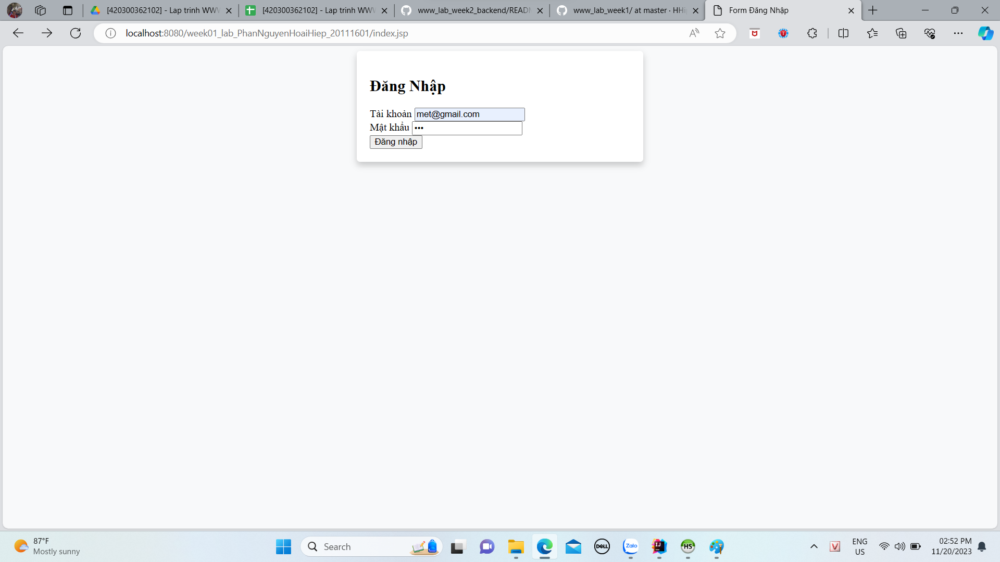
13.Xem được thông tin sau khi đăng nhập:
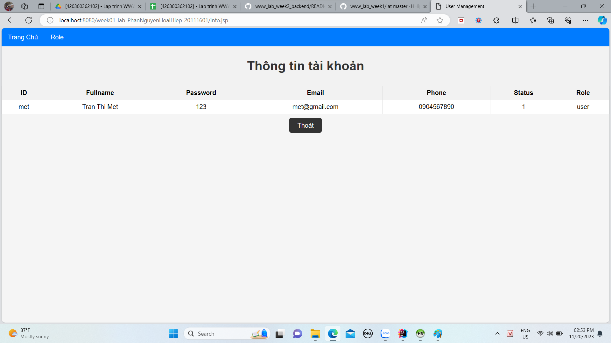
14.Xem role:
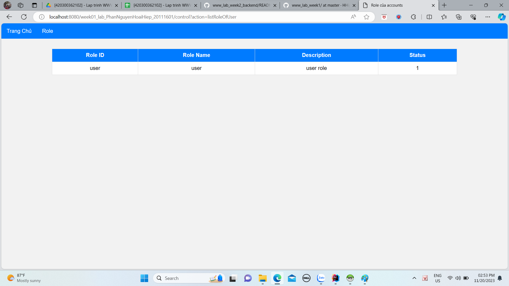